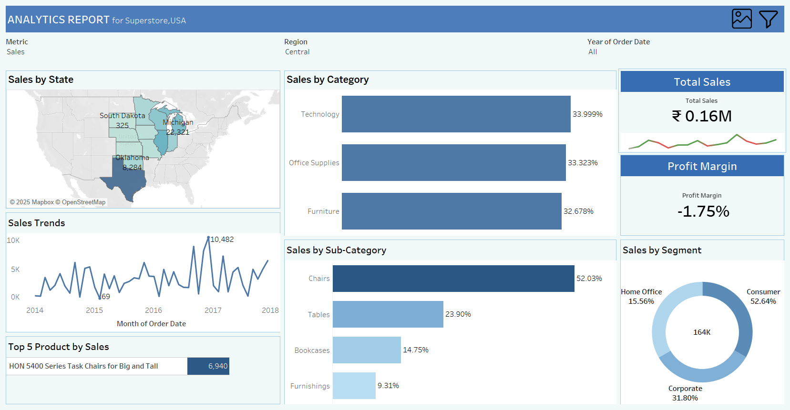

# 📊 Sales Performance Dashboard (Tableau)


### 📊 Overview  

This Tableau project visualizes **sales performance and profitability** for the **Superstore_Dataset**.  
It highlights key business insights using interactive and dynamic visuals to help stakeholders understand trends, product performance, and regional distribution.

---

## 🚀 Project Objective  

To analyze **sales performance**, **profit margin**, and **customer segments** across different regions of the U.S., providing actionable insights for strategic decision-making.

---

## 🚀 Features

- **Dynamic Filters:**  
  - `Metric`: Switch between **Sales**, **Profit**, and **Quantity**.  
  - `Region`: Filter by **Central**, **East**, **West**, or **South** regions.  
  - `Year`: Choose a specific year or view all years combined.

- **Interactive Dashboard Actions:**  
  - Clicking any visual dynamically updates all other charts.  
  - Hover over data points to view detailed tooltips.  
  - Drill-down analysis by **State**, **Category**, and **Segment**.

---

## 🧩 Dashboard Components  

| Section | Description |
|----------|--------------|
| **Sales by State** | Map view showing state-wise performance based on the selected metric. |
| **Sales by Category** | Horizontal bar chart representing category-wise contribution (Technology, Furniture, Office Supplies). |
| **Sales Trends** | Line chart showing month-over-month sales or profit trends. |
| **Top 5 Products by Sales** | Identifies top-performing products driving the majority of revenue. |
| **Sales by Sub-Category** | Compares sub-category performance (Chairs, Tables, Bookcases, etc.). |
| **Sales by Segment** | Donut chart visualizing contribution from Consumer, Corporate, and Home Office segments. |
| **KPI Cards** | Highlight key figures such as Total Sales and Profit Margin. |

---

## 📈 Insights 

- **Highest Sales State:** Michigan  
- **Top Category:** Technology (33.99%)  
- **Leading Sub-Category:** Chairs (52.03%)  
- **Dominant Segment:** Consumer (52.64%)  
- **Profit Margin:** -1.75%

*(Note: These values change dynamically based on applied filters.)*

---

## ⚙️ Dashboard Interactivity  

✅ Interactive Filters (Metric, Region, Year)  
✅ Dynamic KPIs with trend indicators  
✅ Geo-map integration for regional performance  
✅ Clean, corporate-themed layout with consistent color palette  

---

## 🛠️ Tools & Technologies

- **Tableau Desktop**: For data visualization and dashboard creation  
- **Superstore Dataset**: Sample dataset for sales, profit, and customer analysis
- Advanced Tableau features: Calculated Fields, Parameters, Filter & Highlight Actions, Story Points 

---

## 📊 Dashboard Preview



---

## 🔗 Live Preview 

[🔗 View Live Dashboard on Tableau Public](https://public.tableau.com/app/profile/shadan.sarfaraz/viz/Sales_Performance_Dashboard_17610908572640/Sales_Performance_Dashboard?publish=yes)

---

## 📂 Project Files
```bash
01_Sales_Performance_Dashboard/
├── Sales_Performance_Dashboard.twbx 
├── Superstore_Dataset.xls
├── Dashboard_Preview.png 
└── README.md 
```
h
---

## 📬 Author

**shadantech**  

_Data Analyst_

🔗 (http://www.linkedin.com/in/shadantech)

⭐ **If you like this dashboard, don't forget to star the repo!**

